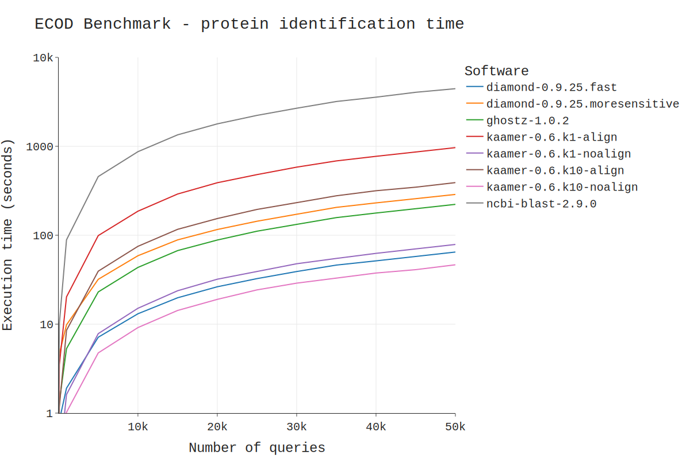
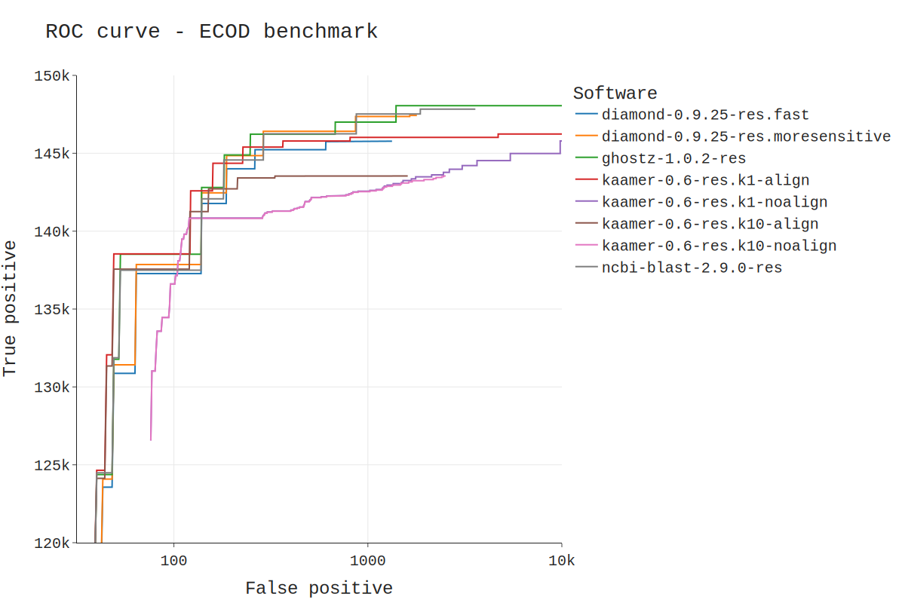

# ECOD benchmark

## Requirement

* Docker

## Software tested

* diamond v0.9.25 (fast mode)
* diamond v0.9.25 (more sensitive mode)
* ghostz v1.0.2 (default mode)
* ncbi-blast v2.9.0 (default mode)
* kaamer v0.6 k1 (alignment mode - with at least 1 kmer match)
* kaamer v0.6 k1 (kmer match mode - with at least 1 kmer match)
* kaamer v0.6 k10 (alignment mode - with at least 10 kmer matches)
* kaamer v0.6 k10 (kmer match mode - with at least 10 kmer matches)

## Running the ECOD benchmark

* Clone this repo
``` shellsession
git clone git@github.com:zorino/kaamer-benchmark.git
cd kaamer-benchmark/ecod-benchmark
```

* Build the docker images for each software
``` shell
for i in \
    diamond-0.9.25-res.h_name.fast.sh \
    ghostz-1.0.2-res.h_name.sh \
    kaamer-0.6.0-res.h_name.align.sh \
    ncbi-blast-2.9.0-res.h_name.sh
do
    bash $i build
done
```

* Build the database for each software
``` shell
for i in \
    diamond-0.9.25-res.h_name.fast.sh \
    ghostz-1.0.2-res.h_name.sh \
    kaamer-0.6.0-res.h_name.align.sh \
    ncbi-blast-2.9.0-res.h_name.sh
do
    bash $i makedb
done
```

* Run the sensitivity benchmark (all against all)
``` shell
for i in \
    diamond-0.9.25-res.h_name.fast.sh \
    diamond-0.9.25-res.h_name.moresensitive.sh \
    ghostz-1.0.2-res.h_name.sh \
    ncbi-blast-2.9.0-res.h_name.sh \
    kaamer-0.6.0-res.h_name.align.sh \
    kaamer-0.6.0-res.h_name.k10-align.sh \
    kaamer-0.6.0-res.h_name.k10-noalign.sh \
    kaamer-0.6.0-res.h_name.noalign-fast.sh \
    kaamer-0.6.0-res.h_name.noalign.sh
do
    bash $i align
done
```

* Run the speed benchmark (by split 10-50000 queries)
``` shell
for i in \
    diamond-0.9.25-res.h_name.fast.sh \
    diamond-0.9.25-res.h_name.moresensitive.sh \
    ghostz-1.0.2-res.h_name.sh \
    ncbi-blast-2.9.0-res.h_name.sh \
    kaamer-0.6.0-res.h_name.align.sh \
    kaamer-0.6.0-res.h_name.k10-align.sh \
    kaamer-0.6.0-res.h_name.k10-noalign.sh \
    kaamer-0.6.0-res.h_name.noalign-fast.sh \
    kaamer-0.6.0-res.h_name.noalign.sh
do
    bash $i bench
done
```


## Results

The following results were obtain on a Amazon EC2 c5ad.8xlarge instance using the NVMe disk with the following claimed specifications :
  * 32 vCPU
  * 64G RAM
  * 260,526 random read IOPS
  * 113,684 write IOPS

https://docs.aws.amazon.com/AWSEC2/latest/UserGuide/compute-optimized-instances.html

### Speed benchmark




| Nb of query | diamond-0.9.25.fast | diamond-0.9.25.moresensitive | ghostz-1.0.2 | kaamer-0.6.k1-align | kaamer-0.6.k1-noalign | kaamer-0.6.k10-align | kaamer-0.6.k10-noalign | ncbi-blast-2.9.0 |
|-------------|---------------------|------------------------------|--------------|---------------------|-----------------------|----------------------|------------------------|------------------|
| 10          | 0.137               | 3.776                        | 0.565        | 0.41                | 0.132                 | 0.366                | 0.137                  | 0.859            |
| 100         | 0.826               | 4.626                        | 1.341        | 3.506               | 0.266                 | 1.183                | 0.161                  | 10.243           |
| 1000        | 1.907               | 9.832                        | 5.306        | 20.274              | 1.618                 | 8.53                 | 1.022                  | 88.77            |
| 5000        | 7.133               | 31.963                       | 23.042       | 99.126              | 7.827                 | 39.444               | 4.753                  | 457.067          |
| 10000       | 13.092              | 58.836                       | 43.474       | 186.438             | 15.096                | 75.066               | 9.16                   | 870.322          |
| 15000       | 19.813              | 88.679                       | 67.173       | 290.831             | 23.762                | 116.552              | 14.262                 | 1345.886         |
| 20000       | 26.337              | 116.039                      | 88.348       | 389.437             | 32.039                | 154.046              | 19.008                 | 1788.242         |
| 25000       | 32.526              | 143.715                      | 111.037      | 480.618             | 38.944                | 195.086              | 24.297                 | 2227.376         |
| 30000       | 39.076              | 172.231                      | 132.486      | 583.089             | 47.799                | 232.566              | 28.928                 | 2680.939         |
| 35000       | 46.186              | 205.747                      | 157.837      | 685.309             | 54.868                | 277.768              | 33.008                 | 3190.41          |
| 40000       | 51.517              | 231.088                      | 177.746      | 771.666             | 62.562                | 316.6                | 37.59                  | 3569.526         |
| 45000       | 58.071              | 257.386                      | 198.56       | 868.424             | 70.235                | 347.054              | 41.032                 | 4049.99          |
| 50000       | 64.729              | 287.696                      | 222.447      | 966.625             | 78.765                | 390.75               | 46.539                 | 4446.812         |


### Sensitivity benchmark


