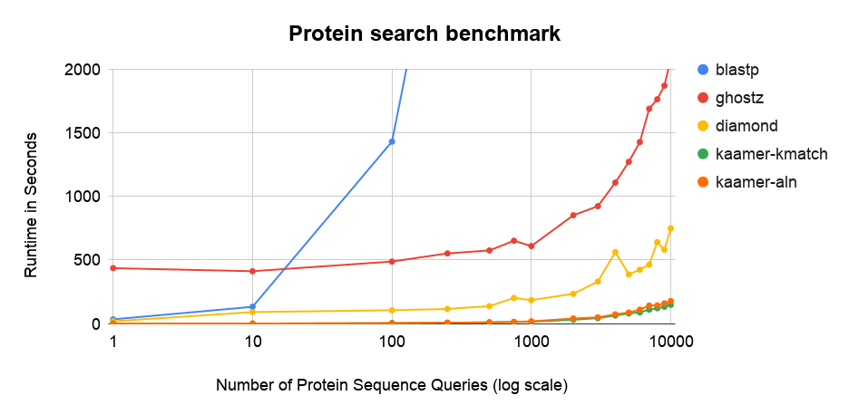

## kAAmer benchmark

## Computer specs

* 32 cores (2 x Intel E5-2683 v4 Broadwell @ 2.1GHz)
* 120 GiB memory
* SATA III connected SSD disk


## Software

* kaamer v0.5
* diamond v0.9.25.126
* ncbi blastp 2.9.0
* ghostz 1.0.2

## Database

The UniprotKB 2019_08 with the fragmented proteins removed.
A total of 114,830,954 proteins.

The database for each software are available at : 
* kaamer: https://kaamer.genome.ulaval.ca/dwl/uniprotkb_bacteria_2019_08.kaamer.tgz
* diamond: https://kaamer.genome.ulaval.ca/dwl/uniprotkb-bacteria.fasta.dmnd
* blast: https://kaamer.genome.ulaval.ca/dwl/uniprotkb-bacteria.blastdb.gz
* ghostz: https://kaamer.genome.ulaval.ca/dwl/uniprotkb-bacteria.ghost.gz


## Command lines used in the benchmark

Each database folder or file was memory mapped with vmtouch (https://hoytech.com/vmtouch/) to
emulate the memory mapping that takes place with kaamer-db.

#### kaamer (no alignment - kmatch only)

``` shell
kaamer-db -server -d uniprotkb_bacteria_2019_08.kaamer
{ /usr/bin/time -f "%E" kaamer -search -t prot -i seq-XXXXX.fasta -o seq-XXXXX.fasta.noaln.tsv -m 10; } 2> seq-XXXXX.fasta.noaln.tsv.time
```

#### kaamer (with alignment)

``` shell
vmtouch uniprotkb_bacteria_2019_08.kaamer
kaamer-db -server -d uniprotkb_bacteria_2019_08.kaamer
{ /usr/bin/time -f "%E" kaamer -search -t prot -i seq-XXXXX.fasta -o seq-XXXXX.fasta.aln.tsv -m 10 -aln; } 2> seq-XXXXX.fasta.aln.tsv.time
```

#### diamond

``` shell
vmtouch uniprotkb-bacteria.fasta.dmnd
{ /usr/bin/time -f "%E" diamond blastp -k 10 -s 1 --comp-based-stats 0 --masking 0 --db uniprotkb-bacteria.fasta.dmnd -q seq-XXXXX.fasta -o seq-XXXXX.fasta.aln.tsv --outfmt 6 ; } 2> seq-XXXXX.fasta.aln.tsv.time 
```

#### blastp

``` shell
vmtouch uniprotkb-bacteria.blastdb
{ /usr/bin/time -f "%E" blastp -num_threads 32 -comp_based_stats 0 -max_target_seqs 10 -db uniprotkb-bacteria.blastdb -query seq-XXXXX.fasta -out seq-XXXXX.fasta.aln.tsv -outfmt 6 ; } 2> seq-XXXXX.fasta.aln.tsv.time
```

#### ghostz

``` shell
vmtouch uniprotkb-bacteria.ghost
{ /usr/bin/time -f "%E" ghostz aln -a 32 -F F -i seq-XXXXX.fasta -o seq-XXXXX.fasta.aln.tsv -b 10 -d uniprotkb-bacteria.ghost ; } 2> seq-XXXXX.fasta.aln.tsv.time
```


## Results





| seq                    | blastp         | ghostz         | diamond       | kaamer-kmatch  | kaamer-aln     |
|------------------------|----------------|----------------|---------------|----------------|----------------|
| 1                      | 0:33.56        | 7:16.49        | 0:18.22       | 0:00.29        | 0:00.62        |
| 10                     | 2:12.35        | 6:52.48        | 1:31.05       | 0:00.64        | 0:00.72        |
| 100                    | 23:52.62       | 8:08.61        | 1:45.24       | 0:03.19        | 0:04.62        |
| 250                    | 1:00:24        | 9:12.63        | 1:55.51       | 0:06.86        | 0:07.60        |
| 500                    | 1:59:13        | 9:35.95        | 2:17.49       | 0:10.06        | 0:10.40        |
| 750                    | 2:55:07        | 10:52.45       | 3:21.32       | 0:12.50        | 0:14.12        |
| 1000                   | 3:55:11        | 10:10.44       | 3:05.03       | 0:14.99        | 0:17.87        |
| 2000                   | 7:46:20        | 14:12.64       | 3:54.76       | 0:30.60        | 0:40.37        |
| 3000                   | +10:00:00       | 15:24.63       | 5:31.23       | 0:43.11        | 0:49.52        |
| 4000                   | +10:00:00       | 18:30.09       | 9:23.00       | 1:03.86        | 1:13.04        |
| 5000                   | +10:00:00       | 21:13.33       | 6:27.64       | 1:19.96        | 1:27.83        |
| 6000                   | +10:00:00       | 23:49.31       | 7:04.50       | 1:28.34        | 1:49.93        |
| 7000                   | +10:00:00       | 28:10.94       | 7:44.34       | 1:50.15        | 2:22.26        |
| 8000                   | +10:00:00       | 29:25.58       | 10:40.95      | 2:01.20        | 2:23.02        |
| 9000                   | +10:00:00       | 31:12.53       | 9:41.88       | 2:12.67        | 2:39.52        |
| 10000                  | +10:00:00       | 34:43.20       | 12:29.26      | 2:28.44        | 2:57.35        |


